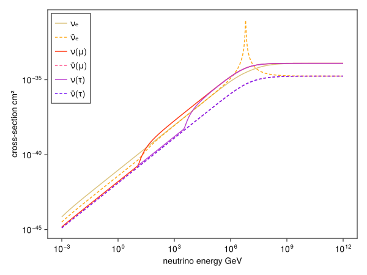

Cross-sections for high energy particle collisions. Currently, I've implemented

from Giunti + Kim (2007) and Gandhi+ (1995)
- neutrino-electron total `σ_tot_nuele( E_nu, nu, T_th=0MeV )`

from Cooper-Sarkar+ (2011)
- neutrino-nucleon CC DIS `σ_tot_CCDIS(E, nu)`
- neutrino-nucleon NC DIS `σ_tot_NCDIS(E, nu)`

from Kafexhiu+ (2014) 
- proton-proton total inelastic `σ_inel_pp( E_proton )`
- proton-nucleus total inelastic `σ_inel_pnuc( T_proton, A_targ )`
- nucleus-nucleus total inelastic `σ_inel_nucnuc( T_projectile_per_nucleon, A_projectile, A_targ )`

